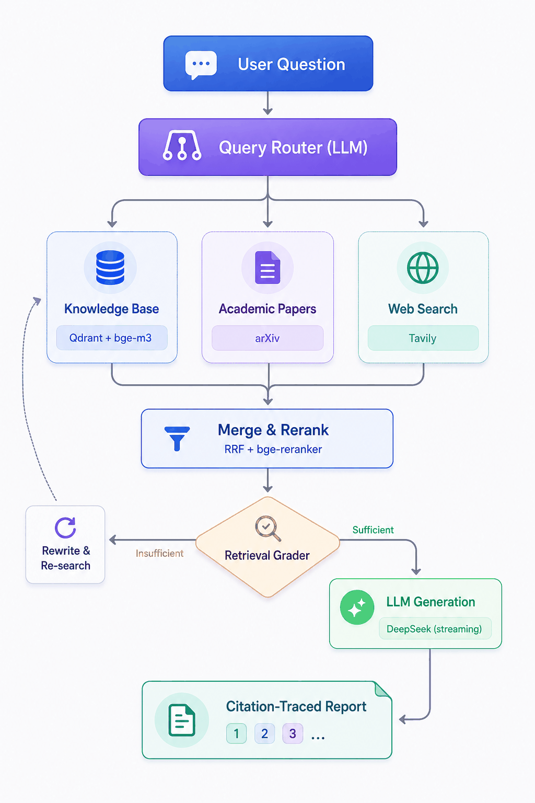
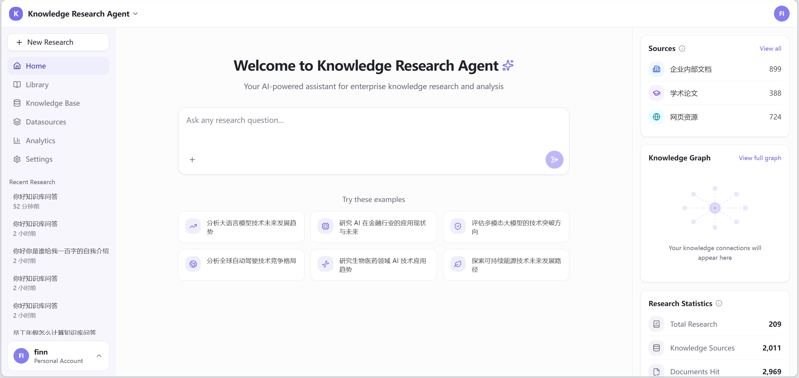
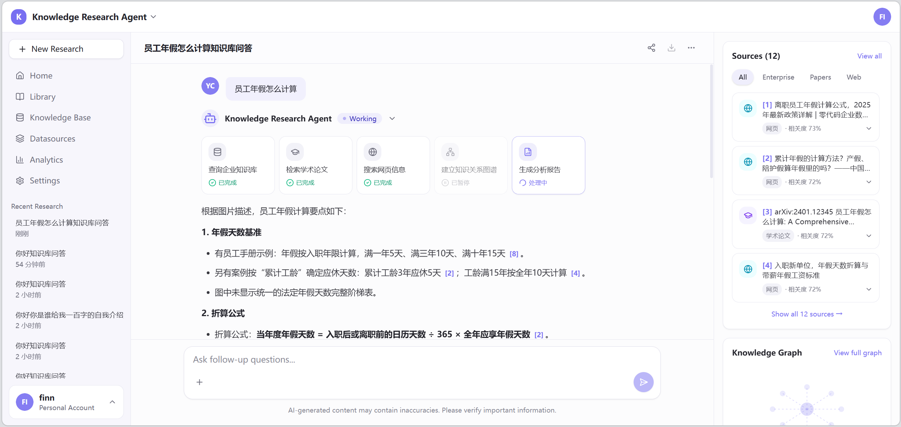
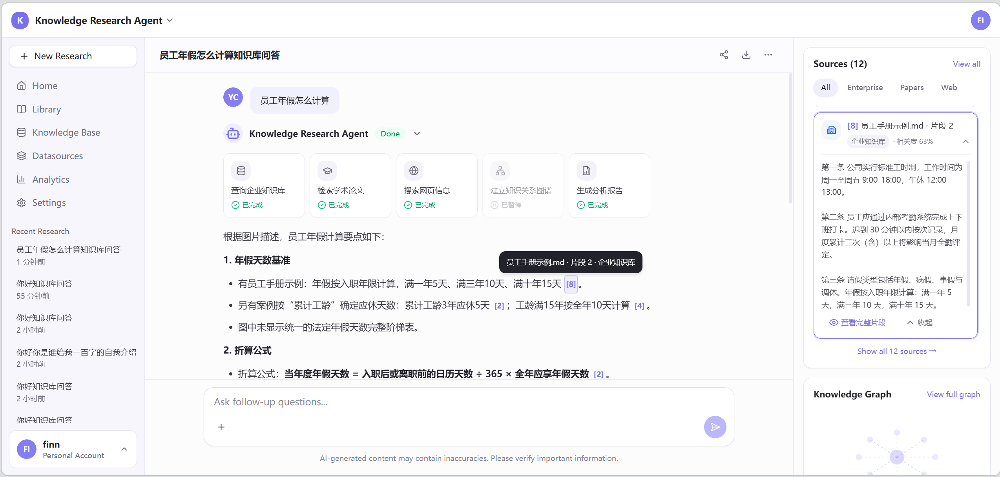
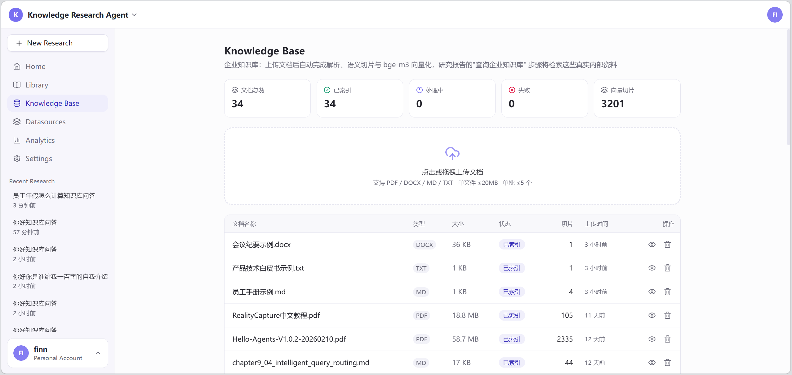

# Knowledge Research Agent

<div align="center">

[](LICENSE)
[](https://www.python.org/)
[](https://react.dev/)
[](https://www.langchain.com/langgraph)
[](https://qdrant.tech/)

**企业级 Agentic RAG 知识研究助手**：输入一个问题，系统自动完成多源检索、质量判断与反思重查，生成带引用溯源的研究报告。

[English](README.md)

</div>

---

## 📐 架构

<div align="center">
  
</div>

```
用户提问 → 意图路由（闲聊 | 知识问题）
    → 三路并行检索（企业知识库 ∥ arXiv 论文 ∥ Tavily 网页）
    → 融合 + RRF + bge-reranker 精排
    → Retrieval Grader 打分 ── 低质量 → 改写重查（≤2 轮）
    → LLM 生成（DeepSeek 流式，强制 [n] 引用）
    → 回答核查 → 带引用溯源报告
```

## ✨ 核心特性

| 能力 | 说明 |
|---|---|
| **Agentic RAG（Self-RAG）** | LangGraph 低层 StateGraph 手写 7 节点：并行检索 + Grader 判断 + 改写重查循环 |
| **混合检索** | bge-m3 一次前向产出 dense（1024 维）+ sparse 双表示 → 双路召回 + RRF(k=60) + bge-reranker 精排 |
| **查询增强** | LLM 改写 + 关键词扩展；dense/sparse 双路分离应用；增强无命中自动回退原问题 |
| **多源检索** | 企业知识库（Qdrant）+ arXiv 论文 + Tavily 网页 三路并行 |
| **PDF 智能解析** | 类型分流（原生/扫描/图文混排）→ 版面还原（阅读顺序/页眉页脚/标题/页码）→ RapidOCR 图片识别 + VLM 图表描述（OpenAI 兼容，默认 mimo-v2.5） |
| **Parent-Child 切片** | child（650 token）精准检索 + parent（章节级 2000 token）完整上下文 |
| **引用溯源** | 每条论断强制 [n] 标注、页码定位、片段全文核对（/kb/chunk 端点） |
| **多轮对话** | 追问重跑流水线，报告多版本保留 |
| **流式交互** | SSE 事件驱动：步骤状态/来源增量/grader 打分/报告 token 实时推送，断线重连 + 完成自动校准 |
| **评估体系** | RAGAS 四指标 + Golden Dataset + 双口径 + 参数对比工具，before/after 量化优化 |
| **Mock 降级** | 无 API Key 也能完整演示（LLM 摘录兜底、模拟来源），逐级降级链路永不中断 |

## 🖼 效果截图

<div align="center">
  
  &nbsp;&nbsp;
  
  <br /><br />
  
  &nbsp;&nbsp;
  
</div>

*首页 · Agent 工作过程 · 引用溯源 · 知识库摄入*

## 🚀 快速开始

### 环境要求

- Python 3.11（conda 环境，后端依赖见 `requirements.txt`）
- Node.js 18+（前端）
- Docker（可选：向量库 Qdrant；也可使用已有 Qdrant，改 .env 的 QDRANT_URL）

### 1. 启动向量库

```bash
docker compose -f infra/docker-compose.yml up -d qdrant
```

### 2. 下载本地模型（约 4.4GB，存储于项目 models/ 目录）

```bash
cd apps/api
python scripts/download_models.py   # bge-m3 + bge-reranker-v2-m3（经 hf-mirror）
```

### 3. 配置（复制模板并填写）

```bash
cp apps/api/.env.example apps/api/.env
```

```ini
DEEPSEEK_API_KEY=        # LLM（留空则报告用真实片段摘录兜底）
TAVILY_API_KEY=          # 网页搜索（留空走模拟网页来源）
VLM_API_KEY=             # 图表描述（留空则跳过 VLM 描述）
# 以上三个 Key 全部留空也能完整演示（Mock 模式）
```

### 4. 启动后端

```bash
cd apps/api
python -m pip install -r requirements.txt
python -m uvicorn app.main:app --port 8000
```

### 5. 启动前端

```bash
cd apps/web
npm install
npm run dev
```

打开 **http://localhost:5173/**，在首页提问即可。

### 6. （可选）上传企业文档

左侧 **Knowledge Base** 页上传 PDF/DOCX/MD/TXT（≤100MB/个，默认值可调），系统自动完成解析 → 切片 → 向量化。

## 📊 数据统计口径说明

首页右侧面板的数字均为**真实数据的实时统计**（非展示样例）：

| 面板 | 口径 |
|---|---|
| **Sources** | 历史所有研究**真实检索到**的来源片段，按类型聚合计数（企业内部文档 / 学术论文 / 网页资源）；每次研究完成后自动增长 |
| **Research Statistics** | 累计指标：Total Research=历史研究总次数；Knowledge Sources=累计检索来源总数；Documents Hit=累计命中文档总数；Accuracy Rate=历史平均相关度 |

## 📈 评估体系

```bash
cd apps/api
python -m pip install -r requirements-eval.txt

# 1. 生成评估数据集（从知识库切片生成 QA，默认 40 条）
python eval/scripts/eval_dataset_gen.py 40

# 2. 运行评估（检索层全量 + 生成层真实链路抽样 10 条）
python eval/scripts/eval_run.py --gen 10 --save-baseline

# 3. 查看报告 eval/report.md（指标汇总 + 基线对比 + 低分样例）
# 4. 调参前后对比：python eval/scripts/param_compare.py
```

**基线示例**（40 条数据集）：faithfulness 0.855 · 检索 precision 0.748 · KB 口径 0.772 · recall 0.501（多标注口径）。

## 🗂 目录结构

```
├── apps/
│   ├── api/                    # FastAPI 后端
│   │   ├── app/
│   │   │   ├── agents/         # LangGraph：graph/nodes/state/prompts/events + mock
│   │   │   ├── rag/            # chunker/parsers/models(embedding)/vector_store/ocr/vlm
│   │   │   ├── integrations/   # arXiv / Tavily
│   │   │   ├── llm/            # LLM 网关（DeepSeek + Mock）
│   │   │   ├── services/       # 任务生命周期 / 摄入管线
│   │   │   ├── api/v1/         # REST + SSE 路由
│   │   │   └── models/         # 9 张 ORM 表
│   │   ├── scripts/            # 模型下载 / 测试 / 修复工具
│   │   └── requirements*.txt
│   └── web/                    # React 前端
│       └── src/
│           ├── components/     # ui(原子)/layout/research/sources/graph/stats/kb
│           ├── features/       # researchStore + SSE hook + userStore
│           └── pages/          # home / research / knowledge-base / library
├── eval/                       # 评估体系（数据集/脚本/报告/基线）
├── infra/                      # docker-compose（PG/Qdrant/Redis/MinIO + api/web）
├── docs/                       # 架构/截图/简历与面试文档
└── sample-data/                # 演示用示例文档
```

## 🔌 API 一览

| 方法 | 路径 | 说明 |
|---|---|---|
| POST | `/api/v1/research` | 创建研究任务 |
| GET | `/api/v1/research/{id}/stream` | SSE 事件流（步骤/来源/grader/报告 token） |
| GET | `/api/v1/research/{id}` | 任务详情（报告多版本/来源/统计） |
| POST | `/api/v1/research/{id}/followup` | 追问 |
| POST/GET/DELETE | `/api/v1/documents` | 知识库文档管理 |
| GET | `/api/v1/kb/chunk` | 片段全文溯源 |
| GET | `/api/v1/kb/stats` `/api/v1/sources/stats` | 统计 |
| GET | `/docs` | FastAPI 自带 API 文档 |

## 🐳 部署

- **单机 Docker**：`infra/docker-compose.yml`（PG/Qdrant/Redis/MinIO + api + web），模型以卷挂载
- 生产化路径与服务器方案见 Roadmap（PostgreSQL / Redis Pub-Sub / Celery）

## 📄 License

- 代码：**MIT**（见 LICENSE）
- 模型：bge-m3 / bge-reranker-v2-m3（MIT，BAAI）；RapidOCR 模型随包（Apache 2.0）
- 第三方服务：DeepSeek / Tavily / mimo 需自备 API Key

## 🗺 Roadmap

- [x] Agentic RAG 核心链路（多源 + Self-RAG + 引用溯源）
- [x] PDF 智能解析（OCR + VLM 图表描述）
- [x] RAGAS 评估体系 + 稳定基线
- [ ] 查询路由按源分发（kb / kb+web / kb+paper / 全量）
- [ ] DOCX 图片提取（复用 OCR/VLM 管线）
- [ ] 表格结构化（Docling/PP-Structure 评估）
- [ ] 企业能力：认证（JWT/SSO）、RBAC、审计
- [ ] 生产化：PostgreSQL / Redis Pub-Sub / Celery
- [ ] CI/CD（pytest 整合 + GitHub Actions）
